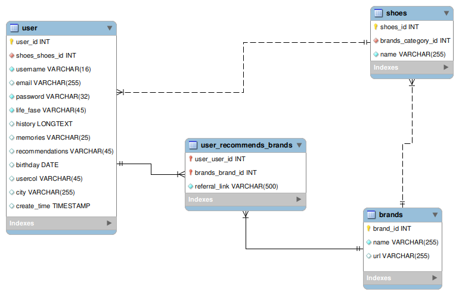

# Bienvenido al repositorio de MY SHOES LIFETIME!

Desde que nacemos como seres humanos llevamos zapatos. ¡Qué maravilloso regalo para un recién nacido será esta aplicación web! La posibilidad de registrar toda una colección de zapatos dará lugar a buenos recuerdos, ¡seguro! ¿Y todo esto para qué? ¡para entretenerse! ¡Imagínese a sus noventa años, recordando sus zapatos favoritos en aquellos increíbles años de juventud!

Para llevar a cabo el proyecto, hemos prestado atención a cada uno de los pasos que se describen a continuación: #deboracodesinjava 🚀

# Entrega

  
<strong>🗓 Fecha de la Entrega</strong>

  * Projeto individual.
  * Serão `6` dias de projeto.
  * Data de entrega para avaliação final do projeto: `27/07/2022 14:00`.

  
<strong>🤷🏽‍♀️ Diagrama Entidad-Relacionamiento y video</strong>
 
  #### Diagrama de Entidade-Relacionamento

  Para orientar la construcción de las tablas atraves del ORM, utilizamos el seguiente *DER*:

  
  
  #### Video

  Visualize lo que tenemos hasta el momento:

  ![VIDEO(https://drive.google.com/file/d/1l-YjHH-37V5gQSfAGf4itm7MUjckOhI6/view?usp=sharing)

